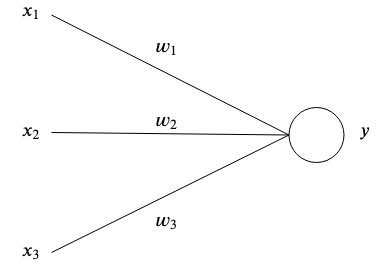

# Linear associative networks

This is the simplest artifical neural network possible. 

## Table of Contents
* [Overview](#overview)  
  * [What is a perceptron?](#what-is-a-perceptron)
  * [A simple example](#a-simple-example)
  * [The error](#the-error)

## Overview

### What is a perceptron?

It's the simplest conceptual representation of a neuron. 
In essence, a perceptron has one or multiple inputs  each having a specific weight  and one output . 

At the simplest level, the perceptron's output is the sum of it's inputs times its weights. 

### A simple example

Say we have a perceptron with two inputs  and , with weights  and .  

Then the output  will be

### The error

If the output  doesn't match the expected result, then we have an error.  
For example, if we wanted to get an expected output of  then we would have a delta of 

and we would need to adjust the weights in order to rectify that error. In our example, lowering  from  to  would do the trick, since 

However, in order to adjust the weights of our neural networks for many different inputs and expected outputs, we need a *learning algorithm*. 
