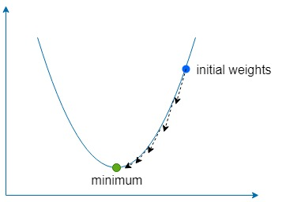

# Simplest artificial neural network

This is the simplest artificial neural network possible explained and demonstrated. 

## This is part 1 of a series of github repos on neural networks

- part 1 - simplest network (**you are here**)
- [part 2 - backpropagation](https://github.com/gokadin/ai-backpropagation)
- [part 3 - backpropagation-continued](https://github.com/gokadin/ai-backpropagation-continued)
- [part 4 - hopfield networks](https://github.com/gokadin/ai-hopfield-networks)

## Table of Contents

- [Theory](#theory)  
  - [Mimicking neurons](#mimicking-neurons)
  - [A simple example](#a-simple-example)
  - [The error](#the-error)
  - [Gradient descent](#gradient-descent)
- [Code example](#code-example)
- [References](#references)

## Theory

### Mimicking neurons

Artificial neural networks are inspired by the brain by having interconnected artificial neurons store patterns and communicate with each other. 
The simplest form of an artificial neuron has one or multiple inputs  each having a specific weight  and one output . 

At the simplest level, the output is the sum of its inputs times its weights. 

### A simple example

Say we have a network with two inputs  and  and two weights  and .  

The idea is to adjust the weights in such a way that the given inputs produce the desired output. 

Weights are normally initialized randomly since we can't know their optimal value ahead of time, however for simplicity we will initialize them both with . 

Then the output  will be

### The error

If the output  doesn't match the expected result, then we have an error.  
For example, if we wanted to get an expected output of  then we would have a difference of 

The most common way to measure the error is to use the square difference:

If we had multiple associations of inputs and expected outputs, then the error becomes the sum of each association. 

To rectify the error, we would need to adjust the weights in a way that the actual output matches the expected output. In our example, lowering  from  to  would do the trick, since 

However, in order to adjust the weights of our neural networks for many different inputs and expected outputs, we need a *learning algorithm*. 

### Gradient descent

The idea is to use the error in order to adjust each weight so that the error is minimized.  

##### What is a gradient?

It's essentially a vector pointing to the direction of the steepest ascent of a function. The gradient is denoted with  and is simply the partial derivative of each variable of a function expressed as a vector.  

Example for a two variable function:

##### What is gradient descent?

The *descent* part simply means using the gradient to find the direction of steepest ascent of our function and then going in the opposite direction by a *small* amount many times to find the function *global minimum*.  

We use a constant called the **learning rate**, denoted with  to define how small of a step to take in that direction.  

If  is too large, then we risk overshooting the function minimum, but if it's too low then the network will take longer to learn and we risk getting stuck in a local minimum. 

##### Gradient descent applied to our example network

For our two weights  and  we need to find the gradient of those weights with respect to the error function   

For both  and , we can find the gradient by using the chain rule

From now on we will denote the  as the  term. 

Once we have the gradient, we can update our weights

And we repeat this process until the error is approximately 0​. 

## Code example

The included example teaches the following dataset to a neural network with two inputs and one output using gradient descent:

Once learned, the network should output ~0​ when given two s and ~ when given a  and a . 

## References

- Artificial intelligence engines by James V Stone (2019)